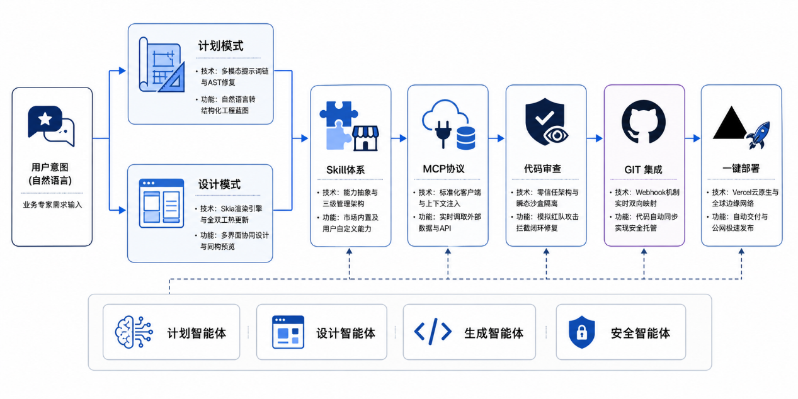
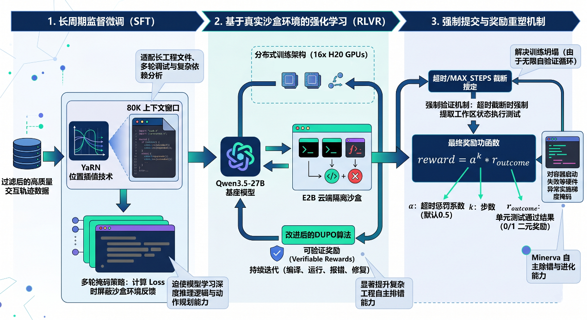
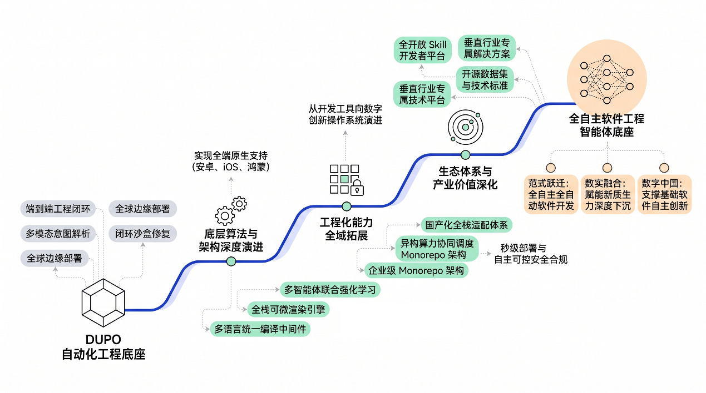
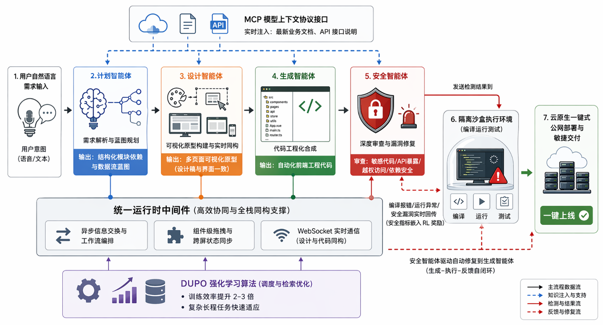

# Minerva 智启


Minerva 智启是一个基于 DUPO 强化学习算法与多智能体协同架构的全栈代码交付平台。项目面向界面设计师、业务专家、高校实践团队与中小企业数字化场景，试图把“自然语言意图”直接转化为可运行、可审查、可同步、可部署的软件工程。

与传统 AI 编码工具只输出静态代码片段不同，Minerva 将需求规划、界面设计、代码生成、安全审查、GitHub 同步与一键部署组织为连续的工程闭环。生成的代码会进入沙盒环境编译、运行和反馈，智能体根据真实错误信息继续修复，让应用从“看起来能写”走向“真正能交付”。

## 项目定位

Minerva 的目标是实现“意图即软件，部署即刻用”。用户可以用自然语言描述业务需求，或通过可视化方式搭建多页面界面，平台随后由计划智能体、设计智能体、生成智能体与安全智能体协同完成从蓝图到上线的流程。

项目重点解决以下问题：

- 非技术用户有明确业务需求，却受限于本地环境配置、依赖冲突、部署链路和代码维护成本。
- 设计师具备视觉与交互能力，但设计稿到可运行前端工程之间存在还原失真和反复返工。
- 现有 AI 代码生成缺少真实执行反馈，容易出现代码不可运行、错误无法自愈、安全风险不可控等问题。
- 复杂软件工程任务需要外部知识、工具调用、版本协作和安全审查，而不是单轮文本补全。

## 核心能力



Minerva 围绕软件生命周期构建了七大核心能力：

1. **计划模式**：将用户自然语言需求转化为包含模块依赖、数据流和交互路径的结构化工程蓝图，并在需求不明确时主动追问。
2. **设计模式**：支持多页面界面设计、组件拖拽、属性编辑、自然语言修改与实时同构预览，帮助设计稿高保真落地为前端工程。
3. **Skill 体系**：把高频工程能力抽象成可安装、可组合、可复用的模块，支持内置 Skill、用户 Skill 与项目 Skill。
4. **MCP 协议调取**：通过 Model Context Protocol 接入外部工具、实时 API 文档、数据库结构和业务知识，突破模型静态训练数据限制。
5. **代码审查**：由安全智能体对 API 暴露、权限越界、依赖风险、敏感信息和注入风险进行多维检测，并给出修复建议。
6. **GitHub 集成**：支持仓库绑定、版本同步、团队协作和远端代码资产托管。
7. **一键部署**：打通代码生成到公网发布的最后一步，面向 MVP 验证和业务系统快速上线。

## 系统架构



Minerva 采用桌面端交互、智能体编排、云端沙盒执行与边缘部署协同的架构：

- **桌面工作台**：基于 Electron、React 与 TypeScript 构建，提供项目管理、聊天式开发、设计模式、预览、代码审查和部署入口。
- **多智能体协同层**：计划、设计、生成、安全等智能体围绕统一上下文工作，形成“需求规划/设计生成 - 代码构建 - 安全审查 - 自动部署”的连续语义流。
- **沙盒执行环境**：在隔离环境中编译、运行和验证生成代码，把构建错误、运行异常、安全扫描结果反馈给智能体。
- **语义工具链**：结合 LSP 语义导航、MCP 工具调用和 Skill 能力市场，让智能体能够更准确地理解工程上下文。
- **云原生交付链路**：集成 GitHub 与 Vercel 等平台能力，实现版本托管、协同开发与边缘分发。

## DUPO 算法



项目将 DUPO（Duplicating Sampling Policy Optimization）用于多轮交互式软件工程智能体训练。根据 `DUPO.pdf` 第 4.2 节，DUPO 的核心目标是在真实沙盒强化学习场景中提升有效梯度密度，减少无效 rollout 带来的训练浪费。

DUPO 的关键设计包括：

- **训练前静态预过滤**：对每个任务执行多次 rollout，剔除全对的简单样本，避免把算力消耗在模型已经掌握的任务上。
- **复制有效样本**：训练过程中仅复制奖励标准差非零的样本，也就是同一组 rollout 中同时包含成功与失败结果的样本。
- **保留有效梯度信号**：通过组相对优势估计、重要性采样比和策略裁剪，让策略更新集中在真正可学习的交互轨迹上。
- **适配真实沙盒反馈**：结合编译、运行、测试和安全审查反馈，将软件工程中的可验证结果转化为强化学习奖励。

在 Minerva 中，DUPO 支撑“生成 - 执行 - 反馈 - 修正”的自闭环，使智能体在长上下文、多工具、多步骤的软件工程任务中保持更稳定的策略学习与错误修复能力。项目材料中给出的工程目标是相较传统动态样本填充方案实现约 2-3 倍训练加速，并提升复杂交互任务下的鲁棒性。

## 安全审查



Minerva 将安全能力内置到生成流程，而不是等代码上线后再补救。安全智能体会对变更进行语义映射，结合静态分析、策略检查、依赖检查和 LLM 推理进行综合判定；当发现高风险问题时，系统可以生成修复建议，并在部署前阻断未修复的高危代码。

安全体系覆盖：

- 敏感密钥与硬编码凭证检测
- API 滥用、权限越界与越权访问检查
- 第三方依赖风险与供应链安全检查
- 注入风险、资源泄漏与不安全配置识别
- 沙盒隔离、编译验证与部署前门禁

## 技术栈

- Electron
- React 19
- TypeScript
- TanStack Router
- TanStack Query
- Drizzle ORM
- SQLite
- Vite
- GitHub / Vercel 集成
- MCP、Skill、多智能体与沙盒执行链路

## 本地开发

### 环境要求

- Node.js `24.x`、`25.x` 或 `26.x`
- npm

### 安装依赖

```sh
npm install
```

如果 macOS 上的全局 npm 缓存存在旧版 `sudo` 安装导致的权限问题，可以使用临时缓存：

```sh
npm install --cache /private/tmp/minerva-npm-cache
```

### 配置环境变量

复制 `.env.example` 为 `.env`，按需填写模型、搜索、GitHub 和部署相关密钥。

常见变量包括：

- `OPENAI_API_KEY`
- `ANTHROPIC_API_KEY`
- `GOOGLE_API_KEY`
- `GITHUB_CLIENT_ID`
- `GITHUB_CLIENT_SECRET`
- `SERPER_API_KEY`
- `JINA_API_KEY`

`.env` 已被 git 忽略，不应提交到仓库。

### 启动开发环境

```sh
npm start
```

如需显式使用开发环境变量：

```sh
npm run dev
```

## 常用命令

```sh
# 格式化
npm run fmt

# 代码检查
npm run lint

# TypeScript 类型检查
npm run ts

# 单元测试
npm test

# 打包应用
npm run package

# macOS 本地打包，不进行 Apple 签名和公证
npm run package:mac

# 生成安装包 / 分发产物
npm run make

# 构建 e2e 测试所需应用
npm run build
```

## macOS 打包

本地开发时可使用：

```sh
npm run dev
npm run package:mac
npm run make:mac
```

这些本地命令会跳过 Apple 代码签名和公证，适合没有 Apple Developer 凭证的开发机。正式发布可配置以下变量：

- `APPLE_TEAM_ID`
- `APPLE_ID`
- `APPLE_PASSWORD`
- 可选：`MACOS_SIGN_IDENTITY` 或 `APPLE_SIGNING_IDENTITY`

## 测试

### 单元测试

```sh
npm test
```

### E2E 测试

E2E 测试依赖打包后的应用，修改应用代码后需要先重新构建：

```sh
npm run build
npm run e2e
```

运行单个测试文件：

```sh
npm run e2e e2e-tests/context_manage.spec.ts
```

## 开源协议

- `src/pro` 之外的代码使用 Apache 2.0 协议，详见 [LICENSE](./LICENSE)。
- `src/pro` 内代码使用 Functional Source License，详见 [src/pro/LICENSE](./src/pro/LICENSE)。
